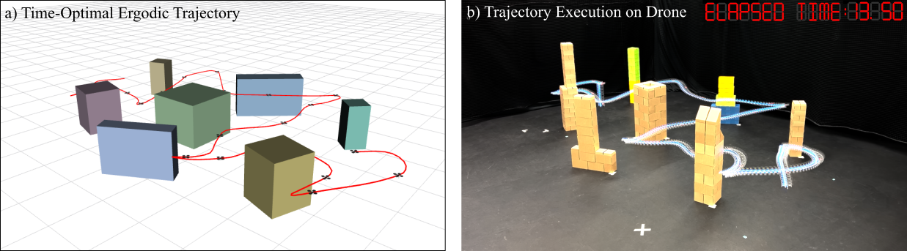

<h1 align="center">
    Time-Optimal Ergodic Search
</h1>

<p align="justify">
Code for <a href="">Time-Optimal Ergodic Search</a>. Dayi Dong, Henry Berger, and Ian Abraham. In Robotics Science and Systems (RSS), 2023.
Additional results and multimedia videos found <a href="https://sites.google.com/view/time-optimal-ergodic-search">here</a>.
</p>

<p align="center">
    
</p>

<p align="justify">
    Robots with the ability to balance time against the thoroughness of search have the potential to provide time-critical assistance in applications such as search and rescue. 
    Current advances in ergodic coverage-based search methods have enabled robots to completely explore and search an area in a fixed amount of time. 
    However, optimizing time against the quality of autonomous ergodic search has yet to be demonstrated.
    In this paper, we investigate solutions to the time-optimal ergodic search problem for fast and adaptive robotic search and exploration. 
    We pose the problem as a minimum time problem with an ergodic inequality constraint whose upper bound regulates and balances the granularity of search against time. 
    Solutions to the problem are presented analytically using Pontryagin's conditions of optimality and demonstrated numerically through a direct transcription optimization approach. 
    We show the efficacy of the approach in generating time-optimal ergodic search trajectories in simulation and with drone experiments in a cluttered environment. 
    Obstacle avoidance is shown to be readily integrated into our formulation and we perform ablation studies that investigate parameter dependence on optimized time and trajectory sensitivity for search. 
</p>


## Citation

```
@article{dong2023TimeOptErg,
    title={Time-Optimal Ergodic Search}, 
    author={Dong, Dayi and Berger, Henry and Abraham, Ian},
    journal={RSS},
    year={2023},
}
```